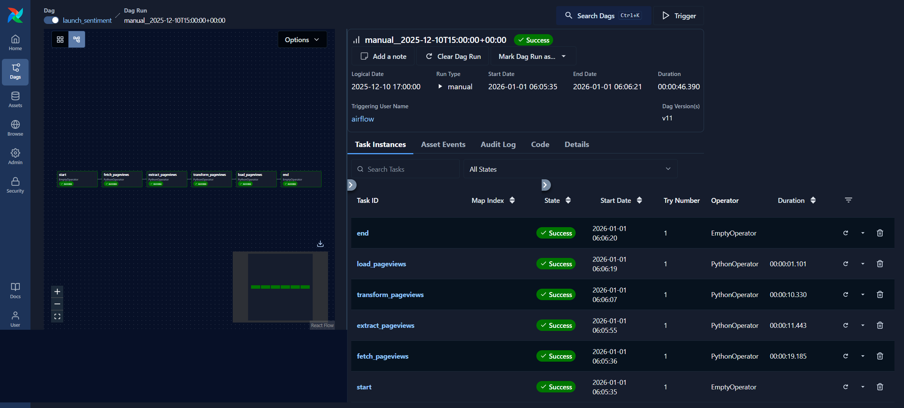

# LaunchSentiment
***Wikipedia Pageviews–Driven Sentiment Pipeline with Apache Airflow***

---

## Table of Contents

 - Project Overview
 - Problem Statement
 - Data Source
 - Key Design Decisions
 - Pipeline Architecture
 - Airflow Time & Scheduling Model
 - Database Schema
 - Project Structure
 - Environment Setup
 - How to Run the Project
 - Validation & Analysis
 - Failure Handling & Idempotence
 - Scaling & Backfills
 - Key Learnings
 - Future Improvements

---

## Project Overview

LaunchSentiment is an **Apache Airflow**–orchestrated data pipeline that ingests hourly Wikipedia pageviews data, processes it to extract view counts for selected companies, and loads the results into a PostgreSQL database for downstream analysis.

The project emphasizes:

 - correct time semantics
 - idempotent, retry‑safe task design
 - deterministic outputs
 - clean separation of orchestration and business logic

This mirrors real‑world data engineering patterns while remaining lightweight and easy to run locally.

---

## Problem Statement

Public attention is often correlated with sentiment.
This project explores a simple hypothesis:

 **An increase in a company’s Wikipedia pageviews may indicate increased public interest and potentially positive sentiment.**

To test this idea, the pipeline tracks hourly pageviews for:

 - Amazon
 - Apple
 - Facebook
 - Google
 - Microsoft

---

## Data Source

### Wikimedia Pageviews Dumps

Wikimedia publishes hourly pageviews data in gzip format.

 - Base URL: https://dumps.wikimedia.org/other/pageviews/
 - Example hourly file:
   ```bash
   pageviews-20251210-170000.gz
   ```

### Important Naming Convention

Wikimedia names files using the **end of the hour**.

Example:

 - `pageviews-20251210-170000.gz` -> represents pageviews from **16:00–17:00 UTC**

This convention directly informs the Airflow time design.

---

## Key Design Decisions

 - **Data‑interval–based time handling**
   All paths, URLs, and timestamps are derived from `data_interval_end`.

 - **Idempotent tasks**
   Every task can be retried or backfilled without corrupting state.

 - **Deterministic artifacts**
   Outputs are stable across runs.

 - **DDL included in the load step**
   The pipeline can initialize its own storage layer.

--

## Pipeline Architecture

High-level flow:
```bash
fetch_pageviews
        ↓
extract_pageviews
        ↓
transform_pageviews
        ↓
load_pageviews
```

Each DAG run processes **exactly one hour** of data.



*Airflow Pipeline - 20251210-150000*

---

## Airflow Time & Scheduling Model

 - **Schedule**: `@hourly`
 - **Timezone**: UTC
 - **Anchor timestamp**: `data_interval_end`

Why `data_interval_end`?

 - Airflow runs represent time intervals
 - Wikimedia filenames use hour-end timestamps
 - This creates a clean, offset‑free mapping


*Airflow Pipeline - 20251231-130000*

---

## Database Schema

Target table: `pageviews_hourly`
```bash
CREATE TABLE IF NOT EXISTS pageviews_hourly (
    company_name TEXT NOT NULL,
    pageviews INTEGER NOT NULL,
    hour_timestamp TIMESTAMPTZ NOT NULL,
    created_at TIMESTAMPTZ DEFAULT NOW(),
    CONSTRAINT pageviews_hourly_uk
        UNIQUE (company_name, hour_timestamp)
);
```

## Project Structure
```bash
launchsentiment/
│
├── include/
│   ├── common/
│   │   ├── config.py
│   │   └── logger_config.py
│   │
│   ├── sql/
│   │   └── analysis.sql
│   │
│   ├── tests/
│   │   └── test_transform_data.py
│   │
│   └── utils/
│       ├── fetch_pageviews.py
│       ├── extract_pageviews.py
│       ├── transform_pageviews.py
│       └── load_pageviews.py
│
├── data/
│   ├── raw/
│   ├── extracted/
│   └── transformed/
│
├── images/
│
├── launch_sentiment_dag.py
├── requirements.txt
└── README.md
```

---

## Environment Setup

### Prerequisites

 - Python 3.10+
 - Apache Airflow
 - PostgreSQL
 - Git

### Environment Variables

Create a `.env` file:
```bash
PG_HOST=host
PG_PORT=port
PG_DB=db_name
PG_USER=user
PG_PASSWORD=password
LOG_LEVEL=INFO
```
Environment variables are loaded via `config.py`.

---

## How to Run the Pipeline

### 1. Install dependencies

```bash
pip install -r requirements.txt
```

### 2. Start Airflow
```bash
airflow standalone
```

### 3. Add the DAG

Place `launch_sentiment.py` in your Airflow DAGs folder.

### 4. Trigger the DAG

Trigger `launch_sentiment` from the Airflow UI.

Each run processes **one hour of Wikimedia data** based on `data_interval_end`.

---

## Validation & Analysis

Example query to find the company with the highest pageviews:
```sql
SELECT company_name, pageviews
FROM pageviews_hourly
ORDER BY pageviews DESC
LIMIT 1;
```

---

## Failure Handling & Idempotence

 - Atomic file writes in fetch/extract
 - Deterministic CSV outputs
 - Load step runs inside a transaction
 - Delete + insert ensures hour‑level correctness
 - Safe retries and backfills supported

---

## Scaling & Backfills

 - Enable `catchup=True` to process historical hours
 - Each hour produces isolated artifacts
 - Database partitions naturally by `hour_timestamp`
 - Indexing can be added for performance

---

## Key Learnings

 - Airflow is for orchestration, not transformation
 - Idempotence is essential for reliability
 - Deterministic outputs prevent flaky pipelines
 - Clear contracts between tasks simplify reasoning

---

## Future Improvements

 - Company title normalization
 - Data retention and cleanup policies
 - Indexes on `hour_timestamp`
 - Metrics and alerts
 - Visualization layer on top of the data